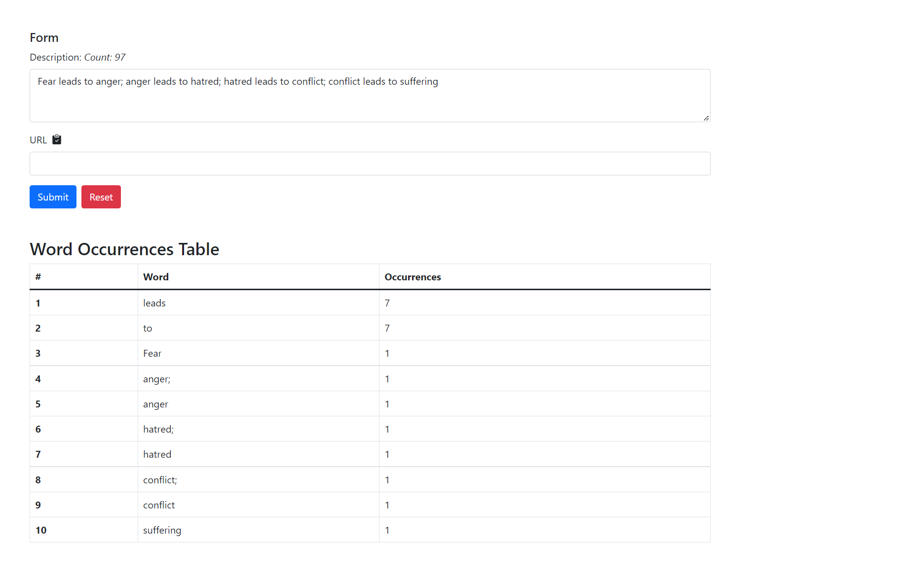
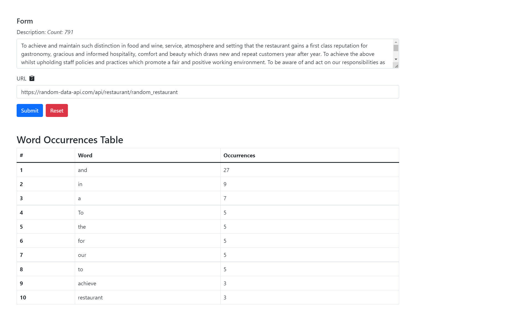

# ulventech-assignment-angular
Assignment to construct two input field. 
1. Description 
2. URL. 
After filling up either of one of these, we Draw a table showing top 10 most occurrences words in description.

## Live at
[Ulventech-assignment-angular](https://mabdullahse.github.io/ulventech-assignment-angular/) 

## Demo Video

Here are few states of form.

## validation-error
  
## fill only description textarea
  
## with url 
  
 
